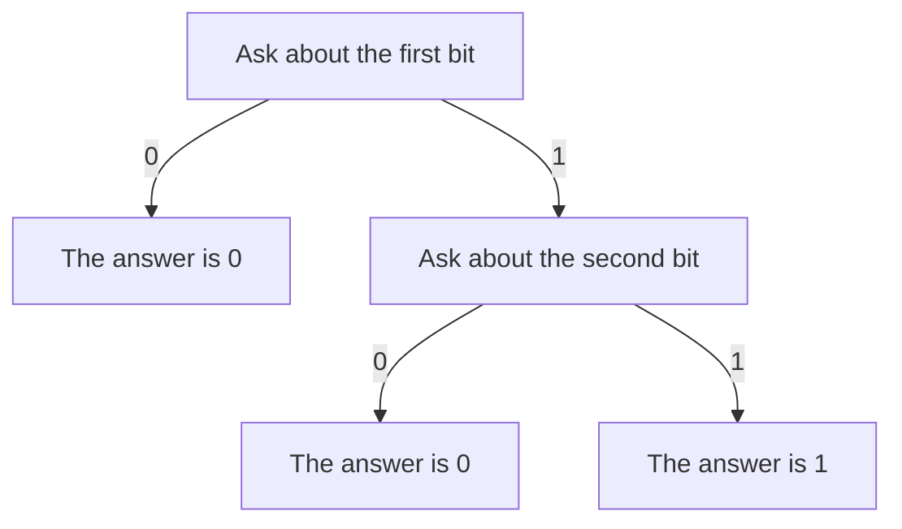
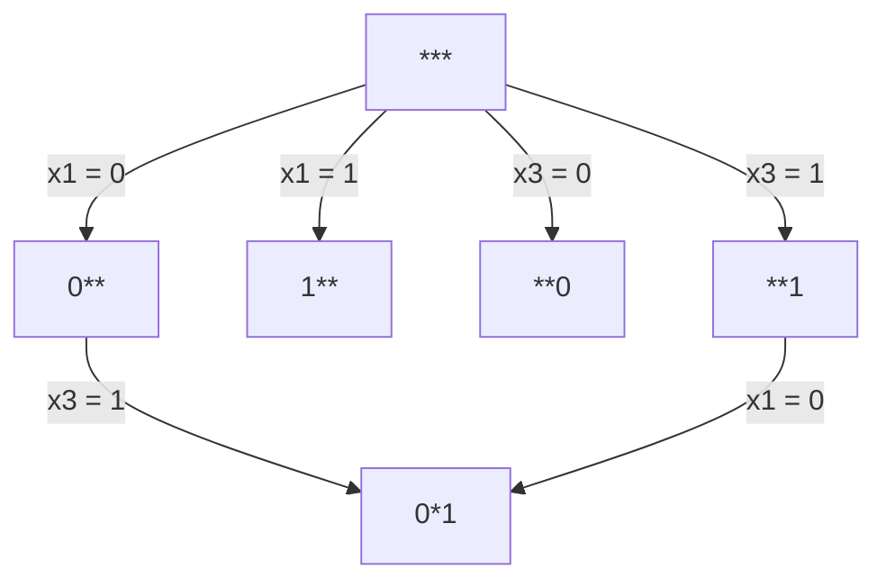

# The ordered restriction model

The model estimates how complicated a Boolean function is to compute with a
decision tree. Its central idea is to give learning the same recursive
structure as the problem: ask a question, understand the two smaller problems
it creates, and combine their difficulty.

This explanation proceeds in three stages:

1. **The idea:** an informal picture of what the model tries to do.
2. **The model:** the objects, rules, and approximations behind that picture.
3. **The implementation:** how those objects appear in the source code.

## Part I. The idea

### Complexity means how many questions we need

Imagine that an input consists of several unknown bits. We want to determine
a Boolean function's value by asking questions such as “is the first bit zero
or one?”

For example, consider the AND of two bits:



Sometimes one question is enough; sometimes we need two. This tree has depth
two, because its longest path asks two questions. It has two internal nodes,
because there are two places where a question is asked.

We want to estimate the best possible depth and the smallest possible tree.
Finding them exactly requires comparing many choices of questions.

### A good question creates easy smaller problems

After a question has been answered, some inputs are no longer possible.
The remaining inputs form a smaller problem. In the example, learning that
the first bit is zero solves the problem immediately. Learning that it is one
leaves the task of determining the second bit.

This suggests a recursive way to reason about difficulty: understand the two
smaller problems, combine their difficulty, and compare the result with what
other questions would achieve.

Many routes lead to the same smaller problem. Learning the first bit and then
the third can leave exactly the same information as learning them in the
opposite order. We can share that smaller problem's result across both routes.

### Learn the recursive reasoning

The ordered model keeps this structure while making the search manageable.
It observes a sample of inputs and their function values, and considers a
selected family of question sequences. Several question orderings provide
different views of the problem, with some freedom to depart from each ordering.

A small neural network learns how to combine the descriptions of two child
problems. The same learned rule is used repeatedly, from the simplest problems
up to the original one. Another learned rule converts the final description
into complexity estimates.

The hope is that a network organized around this recursive reasoning will
learn useful estimates from limited observations. The following part makes
that idea precise, including where its approximations enter.

## Part II. The model

### 1. Inputs, cells, and restrictions

Let an input be an assignment of `n` bits,

$$
x=(x_1,\ldots,x_n)\in\{0,1\}^n,
$$

and let `g(x)` be the Boolean value we want to determine. A **query coordinate**
is a quantity whose zero-or-one value the decision tree may ask for.

An **input cell** is one complete assignment of the query coordinates under
consideration. With three input-bit queries, `001` is one cell. Its target
value `g(001)` is attached to that cell; it is not another query coordinate.

A **restriction** fixes some coordinates and leaves others free. We write
`0*1` for “the first coordinate is zero and the third is one.” The asterisk
means unspecified. On the full three-bit domain, this restriction contains
the cells `001` and `011`; on a sample, it contains whichever of them were
observed. The unrestricted problem is `***`.

There are two kinds of problem:

- **M1:** determine `g(x)` while being allowed to query both the input bits
  and a helper function `f(x)`.
- **M2:** determine `g(x)` only on a specified subset `X`, querying the input
  bits. Values outside `X` do not matter.

For M1, a cell includes a helper coordinate: it has the form `(x,b)`. Consider
both potential cells `(x,0)` and `(x,1)`, with only `(x,f(x))` present for
a particular helper function. For M2, cells are just `x`, and a cell is
present only when `x` belongs to `X`.

This separates the geometry of possible questions from the observations
present in a particular problem. A restriction contains geometric cells, some
of which may be absent for that problem.

### 2. The graph of subproblems

A node represents the coordinates already fixed together with the geometric
cells still possible. The order in which those coordinates were fixed is
irrelevant. These paths therefore reach the same node:

```text
*** -> 0** -> 0*1
*** -> **1 -> 0*1
```

Both parents can use the result for `0*1`. Sharing such subproblems gives a
**directed acyclic graph**, or DAG.

A question contributes a pair of edges, one for each answer. A node can offer
several alternative questions and therefore have more than two outgoing edges.
Here is a fragment; other edges are omitted:



The pair `0**`, `1**` belongs to one question; the pair `**0`, `**1`
belongs to another. Both outcomes of a chosen question must be handled, but
the questions themselves are alternatives.

Every edge fixes one more coordinate, so a path cannot return to an earlier
node. Arrange nodes in layers by how many coordinates have been fixed, then
evaluate from the most restricted problems back toward the root.

Sharing saves repeated computation. It does not change the meaning of tree
size: both subtrees still count when combining a question's branches. Selecting
questions and unfolding shared descendants into separate occurrences would
produce a decision tree.

### 3. The exact recurrence that motivates learning

Let `D(R)` be the minimum remaining depth for a restriction `R`, and `S(R)`
its minimum number of internal tree nodes. Empty restrictions and restrictions
where the target is constant need no questions, so both values are zero.

For other restrictions, the exact recurrences are

$$
D(R)=1+\min_i\max\bigl(D(R_{i=0}),D(R_{i=1})\bigr),
$$

$$
S(R)=1+\min_i\bigl(S(R_{i=0})+S(R_{i=1})\bigr).
$$

Here `i` ranges over useful available questions. Maximum takes the worst
branch's depth, addition counts both subtrees, and minimum chooses the best
question. Depth-optimal and size-optimal questions need not be the same.

For the AND example, querying the first bit gives a solved child with depth
zero and a child with depth one: `1 + max(0,1) = 2`.

These are exact statements about the decision-tree problem. The neural model
uses them as a structural guide rather than computing these scalar recurrences
exactly.

### 4. Which restrictions do we retain?

A full restriction family has three choices per coordinate: leave it free,
fix it to zero, or fix it to one. That gives `3^d` possible restrictions for
`d` query coordinates.

Choose `K` random coordinate orderings. For each ordering, retain
fixed-coordinate sets whose shortest containing prefix has at most two missing
coordinates. Those missing coordinates are postponed questions.

For the ordering `a, b, c, d, e`, the set `{a,c,e}` is allowed: its prefix
ends at `e`, and only `b,d` are postponed. The set `{d}` is not allowed by
this ordering, because three earlier coordinates are missing.

Take the union of the allowed sets from all orderings. A question is permitted
when fixing its coordinate leads to an allowed child set. A path can move
between ordering families; it need not commit to one throughout.

For one ordering, the number of allowed fixed-coordinate sets is

$$
1+d+\binom{d}{2}+\binom{d}{3}.
$$

With `Q` geometric cells, each fixed set partitions them into at most `Q`
nonempty groups. The graph therefore has an `O(KQd^3)` node bound. Singleton
groups need no further subdivision.

The graph distinguishes which coordinates were fixed as well as which cells
remain. Restrictions containing the same sampled cells can still admit
different future questions.

### 5. What information lives at a node?

Each node carries two kinds of state.

The first records which target values occur among its present observations:

- `(0,0)`: no observation is present.
- `(1,0)`: only target zero is present.
- `(0,1)`: only target one is present.
- `(1,1)`: both target values are present.

These presence flags are exact for the observations. A parent's flags are the
logical OR of its children's flags. Further reasoning is needed only when both
target values occur.

The second state is a learned vector `h(R)` of width `H`. Its components
have no prescribed individual meaning. Empty and constant restrictions receive
the zero vector.

There is no learned embedding of a raw cell at the start. Leaf states are zero.
Observed target values determine which larger restrictions are constant, and
therefore where nonzero learned states can develop.

### 6. The learned recurrence

For one allowed question, let `a` and `b` be its child vectors. A shared
learned function `combine` produces a candidate parent vector:

$$
v_i=\mathrm{combine}\bigl([\max(a,b),\ a+b]\bigr).
$$

Maximum and addition act componentwise; brackets denote concatenation.
They expose the same kinds of information used by the exact depth and size
recurrences.

If a question does not split the geometric cells into two nonempty groups,
its candidate vector is simply `max(a,b)`. Otherwise the learned combination
is used. This test concerns geometry; target constancy concerns the observations
present in the particular problem.

For each component `j`, the parent takes

$$
h(R)_j=\min_i(v_i)_j,
$$

unless it is empty or constant, in which case its state is zero. The same
function `combine` is used everywhere as the graph is evaluated toward the root.

Different components can take their minimum from different questions. This
produces a learned summary, not a certificate of one realizable decision tree.

### 7. From the root to a prediction

A second learned function `head` maps the root state to two values. The model
predicts

$$
\widehat y=n-\mathrm{head}(h(\text{root})).
$$

The target scores are

$$
y_D=n-D,\qquad y_S=\log_2(2^n-S),
$$

where `D` and `S` are the optimal depth and internal-node count for the
original problem. Larger scores mean simpler functions. Constants have both
scores equal to `n`; maximal costs `D=n` and `S=2^n-1` give scores zero.

Learning adjusts `combine` and `head` to make root predictions close to these
targets. The first component of `head` approximates depth, while the second
approximates `n-log2(2^n-S)`, not raw size.

### 8. What the approximation assumes

There are three sources of approximation: observing only a sample, retaining
only a family of restrictions, and learning vector updates instead of exact
scalar costs.

A sample can miss a change in the function. A restriction family can miss a
useful question sequence. Even with full coverage, learned updates and the
readout need not reproduce the exact answer.

A constant restriction's zero state does not force an exact root prediction,
because `head(0)` is learned. Predictions are also not constrained to the target
score range. The structural bias is the intended advantage; accuracy and cost
at larger bitness remain empirical questions.

## Part III. Connection to the source code

### 1. Where the pieces live

[`src/model.py`](../src/model.py) separates graph construction and evaluation:

- `OrderedTopology` produces graph indices through a temporary
  `_TopologyBuilder`, then discards the construction state.
- `OrderedRestrictionPredictor` prepares cases, obtains their topology, and
  evaluates learned states from the leaves to the root.
- Its `combine` network and its `head` are those two learned functions.

It is the project's only model, configured by the `model` block of
[`conf/train.yaml`](../conf/train.yaml). The widths are `hidden`,
`branch_hidden`, and `head_hidden`; `orders` and `order_seed` control the
ordering family. Target transforms live in
[`score.cpp`](../cpp/common/tools/score.cpp). The shared C++ graph is described
in [graph.md](graph.md).

### 2. From packed cases to the prepared input

`forward(packed)` starts with packed `uint8` cases. Let
`P = sampling.batches * sampling.points_in_batch`. Each case has
`P * (3*n + 2)` meaningful bits, unpacked into shape
`(batch_size, P, 3*n + 2)`.

The point fields are the input bits, `g(x)` and its single-bit-neighbour
values, then `f(x)` and its neighbour values. This predictor uses only the
input bits and the direct values `g(x), f(x)`.

`_unpack_sampled_points` unpacks on CPU. `_group_cases_by_input_set` sorts
and deduplicates assignments with `np.unique`, keeps the first occurrence's
function values, and groups cases sharing an input set.

Each group is evaluated as

```python
self.forward_values(values, topology)
```

For `B` cases sharing `U` distinct inputs, `values` has shape `(B,U,2)`.
It is CUDA `float32` during training, with the last axis holding
`[g(x),f(x)]`. Entries remain zero or one. The same tensor is called `tables`
inside `forward_values`; it need not be a complete truth table.

`topology` supplies shared connectivity and leaf-cell indices. Input bits
determine that graph; they are not concatenated with function values and fed
to a linear layer. Depth and size targets enter the loss separately.

### 3. A concrete prepared case

Suppose one case has these sampled observations:

```text
input x     g(x)   f(x)
001          0     1
010          1     0
101          1     1
```

For M2, the NumPy array `coordinates` is

```python
coordinates = [
    [0, 0, 1],
    [0, 1, 0],
    [1, 0, 1],
]
# Each row is a cell; each column is a query coordinate.
```

The prepared function values are

```python
values = [
    [[0.0, 1.0], [1.0, 0.0], [1.0, 1.0]]
]
# Tensor shape after conversion: (1, 3, 2).
```

For M1, `_expand_helper_coordinates` makes all `(x,0)` cells followed by all
`(x,1)` cells. The topology then has six geometric cells, but `values` still
has three rows per case.

`_observe_target_values` converts function values into presence flags. For M1:

```text
cell (x,helper)    target-0 present    target-1 present
(001,0)                  0                   0
(010,0)                  0                   1
(101,0)                  0                   0
(001,1)                  1                   0
(010,1)                  0                   0
(101,1)                  0                   1
```

This `observed` tensor has shape `(1,6,2)`. For M2, no helper expansion
occurs: it is `[[[1,0],[0,0],[0,1]]]`, with shape `(1,3,2)`. The middle input
is absent because its subset indicator is zero.

In general, `observed` has shape `(B,Q,2)`, with `Q=2U` for M1 and `Q=U`
for M2. Presence is `((1-g)*f,g*f)` for M2. M1 uses that expression for the
helper-one block and `((1-g)*(1-f),g*(1-f))` for the helper-zero block.

### 4. Building the topology

`_remove_equivalent_query_columns` removes constant columns and keeps one
representative of duplicate or complemented columns. It normalizes against
the first row using `coordinates ^ coordinates[:1]`, retaining the first
representatives in their original column order. This equivalence concerns
only the sampled geometry.

`_make_ordering_prefixes` generates seeded permutations.
`_shortest_covering_prefix` locates the prefix containing a fixed-coordinate
mask; `_queries_entering_ordering` identifies eligible next coordinates.
`_QueryChoices.candidates` unions their results and caches them by mask,
returning coordinates in increasing index order.

Postponed coordinates are counted as `holes`. Three holes are considered
because filling one can make a child satisfy the two-hole rule. With more than
three, one question cannot make that ordering eligible.

`_TopologyBuilder.visit_restriction` identifies a node with two integer
bitsets: `mask` for fixed coordinates and `members` for remaining cells.
Fixed values are implicit in `members`. `_index_one_cells` precomputes which
cells have value one in each coordinate; `_add_query_children` then uses

```python
high = members & self.ones[axis]
low = members ^ high
```

Nodes are memoized in `visited`, and singleton groups stop recursion. A node
belongs to layer `mask.bit_count()`. Empty children use index zero, and all
indices are local to their layer.

`_finalize_layer_tensors` produces:

- `parent`, `zero`, `one`: one parent and two children per candidate question.
- `split`: whether both geometric child groups are nonempty.
- `leaf`, `cell`: singleton markers and observation indices.
- `count`: layer size, including its empty sentinel.
- `first_zero`, `first_one`: one representative child pair per parent.

Despite the names, `_representative_child_pairs` keeps the last recorded pair.
Any pair partitions the same parent cells and suffices to propagate target
presence. The topology also exposes `root`, `dimensions`, `node_count`, and
`mask_count`; the latter two count nonempty visited nodes and cached query masks.

### 5. Evaluating the learned recurrence

`forward_values` calls `_observe_target_values`, then visits layers in reverse.
`_propagate_target_presence` combines child flags using maximum, supplies
observations at leaves, and returns the parent flags. `forward_values` marks
a restriction active when both flags are set.

Hidden states have shape `(B,N,H)` for a layer with `N` nodes.
`_combine_query_children` gathers child states into candidate-question order.
For `E` candidates, `combine` receives `(B,E,2H)` features and returns
`(B,E,H)` states:

```text
2H -> Linear(branch_hidden) -> ReLU -> Linear(H) -> Softplus
```

`_minimum_query_states` uses
`scatter_reduce(..., reduce="amin", include_self=True)` to merge candidates
into parents. The destination starts at positive infinity, the identity for
minimum. `_forward_layer` then zeros empty and constant nodes.

The head receives root states with shape `(B,H)`:

```text
H -> Linear(head_hidden) -> ReLU -> Linear(2)
```

`forward_values` returns `n - head(root_hidden)`, and `forward` restores the
original case order. With the current `H=8`, the first linear layer receives
16 features per candidate question and the head receives eight per case.
Neither receives the raw input coordinates.

### 6. Caching and memory

`_topology_for_input_set` caches only the most recent geometry, keyed by the
bytes of its sorted inputs. One common input set allows repeated reuse;
alternating sets can cause repeated CPU reconstruction. Indices needed by
pending backward passes remain alive even after the explicit cache changes.

Wide intermediate branch tensors can dominate GPU memory.
`_checkpoint_layer_update` uses activation checkpointing when gradients are
enabled: it retains layer inputs and recomputes branch activations during
backward. Each call receives its own layer dictionary, so recomputation uses
the correct graph even after the cache changes.

The options are `use_reentrant=False` and `preserve_rng_state=False`; the
layer update has no random operations. This trades computation for lower
activation memory while preserving batch size and parameter layout. It does
not reduce topology-construction work or eliminate the largest layer allocation.

Validation uses `torch.inference_mode()`. The topology constructor disables
it with `@torch.inference_mode(False)`, making cached indices and masks ordinary
tensors that autograd can use when training resumes.

### 7. Checks and practical limits

[`scripts/test.py`](../scripts/test.py) compares checkpointed predictions and
gradients with the uncheckpointed update on CPU and CUDA for M1 and M2. It also
checks inference-to-training cache reuse, sparse inputs, and full-lattice
coverage at eight bits.

The finite ordering family preserves point-order and input-complement
invariance, but arbitrary coordinate permutations can change the selected
restrictions.

At `m1 8`, the recorded 64-ordering configuration retains all
`3^9 = 19,683` restrictions under complete input coverage. Its accuracy does
not establish equal accuracy for sparse graphs at higher bitness. The
polynomial node bound also has substantial constants, and each node can have
up to `3K` candidate questions.

The [experiments log](experiments_log.md) records the measurements behind these
design choices.
